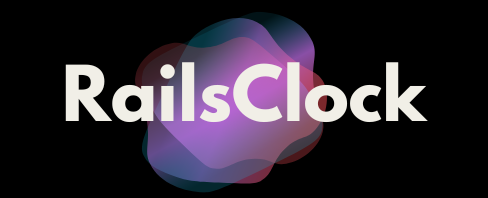

<p align="center">
  
</p>

# RailsClocks

[](https://badge.fury.io/rb/railsclocks)
[](https://github.com/yourusername/railsclocks/actions)
[](https://codeclimate.com/github/yourusername/railsclocks)
[](https://coveralls.io/github/yourusername/railsclocks?branch=main)

## About

RailsClocks is a Rails engine designed for historical debugging and replay of requests and database changes in Rails applications. It allows developers to record HTTP requests and their associated database interactions, making it easier to debug issues and understand application behavior over time.

## Features

- **Request Recording**: Automatically records incoming HTTP requests along with their parameters, headers, and session data.
- **Database Change Tracking**: Captures SQL queries executed during the request lifecycle.
- **Replay Functionality**: Allows you to replay recorded requests to see how your application behaves under the same conditions.
- **Configurable Sampling**: Control the percentage of requests to record, helping to manage performance and storage.
- **Exclusion Paths**: Specify paths that should be excluded from recording, such as asset requests or health checks.

## Installation

### Using RubyGems(Will be available soon)

Add the following line to your application's Gemfile:

```ruby
gem 'railsclocks'
```

Then run:

```bash
bundle install
```

### Manual Installation

1. Clone the repository:

   ```bash
   git clone https://github.com/yourusername/railsclocks.git
   ```

2. Navigate to the project directory:

   ```bash
   cd railsclocks
   ```

3. Copy the `lib/railsclocks` directory into your Rails application's `lib` directory.

4. Require the gem in your application:

   ```ruby
   require 'railsclocks'
   ```

5. Run the generator to create the necessary migration and initializer:

   ```bash
   rails generate railsclocks:install
   ```

6. Run the migration to create the database table:

   ```bash
   rails db:migrate
   ```

## Usage

To configure RailsClocks, you can modify the initializer file located at `config/initializers/railsclocks.rb`. Here are some configuration options:

```ruby
RailsClocks.configure do |config|
  config.enabled = true # Enable or disable request recording
  config.sample_rate = 1.0 # Record all requests by default
  config.excluded_paths = [/assets/, /packs/, /cable/, /healthcheck/] # Paths to exclude from recording
  config.max_request_size_bytes = 1.megabyte # Maximum size of request data to store
end
```

### Recording Requests

Once configured, RailsClocks will automatically record requests based on your settings. You can access recorded requests through the `RecordedRequest` model.

### Replaying Requests

To replay a recorded request, you can use the `ReplayService`:

```ruby
recorded_request = RailsClocks::RecordedRequest.find(request_id)
result = recorded_request.replay
```

## Benefits of Using RailsClocks

### With RailsClocks

- **Enhanced Debugging**: Easily track down issues by reviewing recorded requests and their associated database changes.
- **Performance Insights**: Understand how different requests impact your application's performance.
- **Reproducibility**: Replay requests to reproduce issues in a controlled environment, making it easier to debug and fix problems.

### Without RailsClocks

- **Limited Visibility**: Without request recording, it can be challenging to understand the sequence of events leading to an issue.
- **Time-Consuming Debugging**: Manually reproducing issues without recorded data can be time-consuming and error-prone.
- **Missed Opportunities for Optimization**: Without insights into request patterns and database interactions, you may miss opportunities to optimize your application.

## Wrap Up

RailsClocks is a powerful tool for Rails developers looking to enhance their debugging capabilities and gain insights into their application's behavior. By recording and replaying requests, you can streamline your development process and improve the overall quality of your application.

For more information, visit the [RailsClocks GitHub repository](https://github.com/tanzil7890/railsclocks).

## Contributing

We encourage you to contribute to RailsClocks! Please check out the [Contributing Guide](CONTRIBUTING.md) for guidelines about how to proceed.

## Development

After checking out the repo, run `bin/setup` to install dependencies. Then, run `rake spec` to run the tests.

To install this gem onto your local machine, run `bundle exec rake install`.

## Release Process

To release a new version:

1. Update the version number in `version.rb`
2. Run `bundle exec rake release`

## License

This project is licensed under the MIT License - see the [LICENSE](LICENSE) file for details.

## Security

Please report security issues to [security@yourdomain.com](mailto:security@yourdomain.com).
